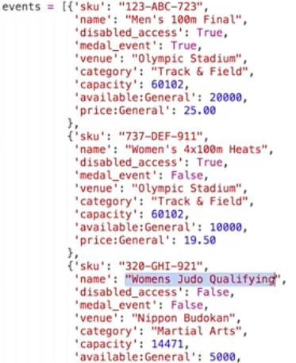
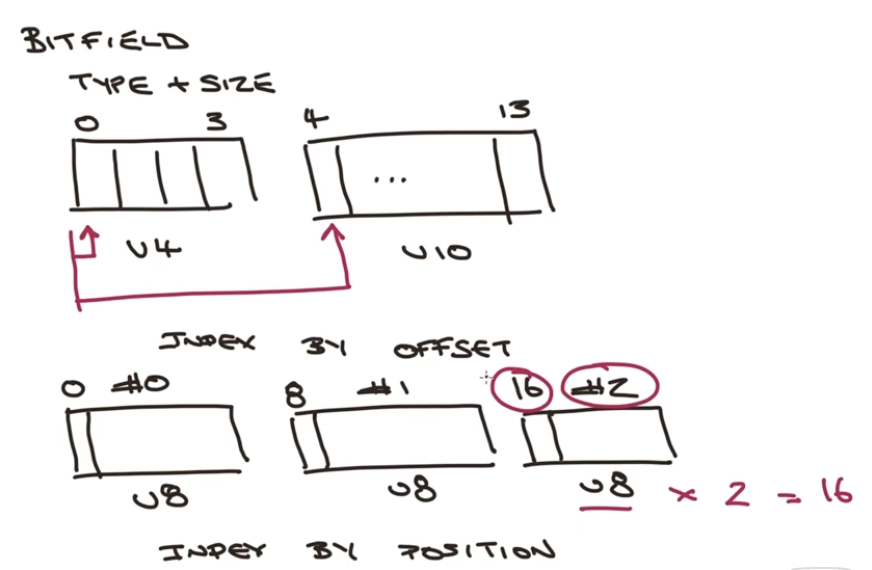

# Week 2

## Cardinality & Capped Collections

- Get cardinality
    - `LLEN key` - for lists
    - `SCARD key` - for sets
    - `ZCARD key` - for ordered sets

- Manage capped collections
    - `LTRIM key start stop`
        - range of elements to retrain
        - from left - positive index
        - from right - negative index
        - 
    - `ZREMRANGEBYRANK key start stop`
        - range of elements to remove
        - 

- use cases
    - sorded set - leaderboard 
        - time complexity: ZADD + ZREMRANGEBYRANK (cheam if you remove just few elements)
    - lists
        - activity stream
        - tc: L/RPUSH+LTRIM - efficient if most elements are retained

- operations for sorted sets work for sets too
    - `ZADD sales:judo 1500 june 200 bill 200 mary`
    - `ZADD sales:wresling 1800 bill 1000 bob 800 mary`
    - `SADD waitlist:taekwondo emma bill mary`
    - intersect set and sorted set with WEIGHTS
    - ZINTERSTORE
        - destination
        - numkeys
        - key [key ...]
        - WEIGHTS weight [weight ...]
        - AGGREGATE SUM|MIN|MAX
    - 
        ```
        ZINTERSTORE promo:taekwondo 3 
            sales:judo sales:wresling waitlist:taekwondo
            weights 1.2 0.8 1000
            aggregate max
        ```
        - 1000 is assigned to set as the score
    - ZUNIONSTORE
        - destination
        - numkeys
        - key [key ...]
        - WEIGHTS weight [weight ...]
        - AGGREGATE SUM|MIN|MAX
    - the union will perform aggregates like SUM that will compute the sum for each key
    - you can do score differences using negative weights


## Faceted Search
- aka Inverted index
- used for:
    - navigation
    - search/filter across multiple criteria

- problem: 
    - find events that match:
        - disabled_access: True/False
        - medal_event: True/False
        - venue: String

- dummy approach
    - `SCAN CURSOR [MATCH PATTERN] [COUNT COUNT]`
        - get all objects that match
    - `GET key` and inspect
    - big complexity - scan * get then deserialize and inspect
    - time linearely increasing

- using sets
    - build sets with each attribute value combination
        - `SADD fs:disable_access:True sku1 sku2`
        - `SADD fs:disable_access:False sku3`
        - `SADD fs:medal_event:True sku1`
        - `SADD fs:medal_event:False sku2 sku3`
        - `SADD fs:venue:"venue 1" sku1 sku2`
        - `SADD fs:venue:"venue 2" sku3`
        - fs means here faceted search, can be anything
    - search with intersect
        - `SINTER fs:disable_access:True fs:medal_event:False`
        - `GET event:name1`
    - when an event is created you need to update the proper sets
    - search function will build the SINTER query from searched attributes
    - time complexity
        - SINTER - time based on cardinality of first set and and the number of sets being intersected O(N*M) then GET with O(1)
        - the cardinality depends on data distribuion - you need **insight inside your data**

- using hashes
    - combine all searchable attributes
    - need consistent hash
        - `SADD hfs:hash_value sku1 sku2`
        - hash value is cryptic, but easy to generate in code
        - to search just scan the set `SSCAN hfs:hash_value` 
    - time complexity: SSCAN O(n)
    - if an event changes you need to change the sets
    - take in account the **rate change of your data**

## Big O notation
- each command has the time complexity defined in the documentation
-  