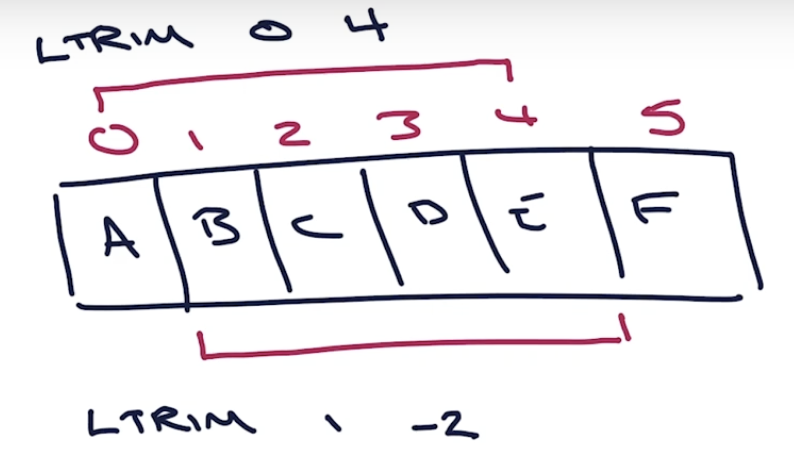
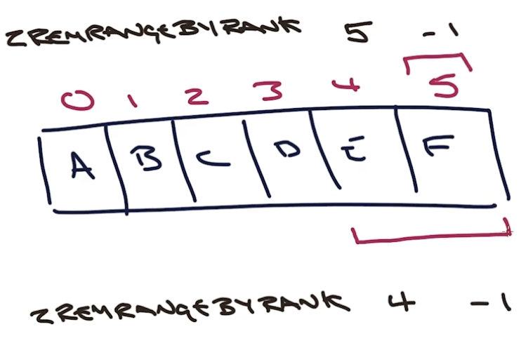
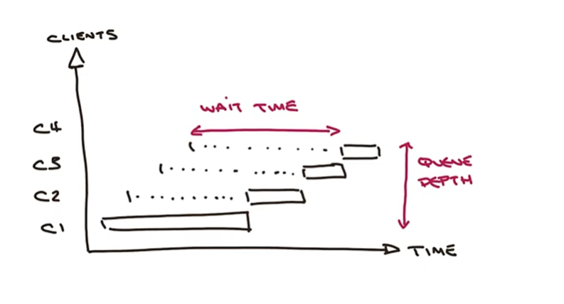
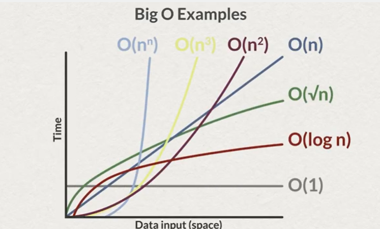
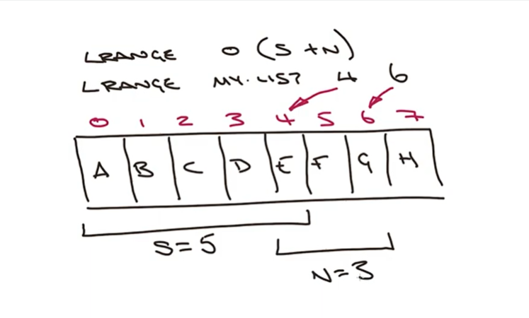

# Week 2

## Cardinality & Capped Collections

- Get cardinality
    - `LLEN key` - for lists
    - `SCARD key` - for sets
    - `ZCARD key` - for ordered sets

- Manage capped collections
    - `LTRIM key start stop`
        - range of elements to retrain
        - from left - positive index
        - from right - negative index
        - 
    - `ZREMRANGEBYRANK key start stop`
        - range of elements to remove
        - 

- use cases
    - sorted set - leader board 
        - time complexity: ZADD + ZREMRANGEBYRANK (ok if you remove just few elements)
    - lists
        - activity stream
        - tc: L/RPUSH+LTRIM - efficient if most elements are retained

- operations for sorted sets work for sets too
    - `ZADD sales:judo 1500 june 200 bill 200 mary`
    - `ZADD sales:wrestling 1800 bill 1000 bob 800 mary`
    - `SADD waitlist:taekwondo emma bill mary`
    - intersect set and sorted set with WEIGHTS
    - ZINTERSTORE
        - destination
        - numkeys
        - key [key ...]
        - WEIGHTS weight [weight ...]
        - AGGREGATE SUM|MIN|MAX
    - 
        ```
        ZINTERSTORE promo:taekwondo 3 
            sales:judo sales:wrestling waitlist:taekwondo
            weights 1.2 0.8 1000
            aggregate max
        ```
        - 1000 is assigned to set as the score
    - ZUNIONSTORE
        - destination
        - numkeys
        - key [key ...]
        - WEIGHTS weight [weight ...]
        - AGGREGATE SUM|MIN|MAX
    - the union will perform aggregates like SUM that will compute the sum for each key
    - you can do score differences using negative weights


## Faceted Search
- aka Inverted index
- used for:
    - navigation
    - search/filter across multiple criteria

- problem: 
    - find events that match:
        - disabled_access: True/False
        - medal_event: True/False
        - venue: String

- dummy approach
    - `SCAN CURSOR [MATCH PATTERN] [COUNT COUNT]`
        - get all objects that match
    - `GET key` and inspect
    - big complexity - scan * get then deserialize and inspect
    - time linearly increasing

- using sets
    - build sets with each attribute value combination
        - `SADD fs:disable_access:True sku1 sku2`
        - `SADD fs:disable_access:False sku3`
        - `SADD fs:medal_event:True sku1`
        - `SADD fs:medal_event:False sku2 sku3`
        - `SADD fs:venue:"venue 1" sku1 sku2`
        - `SADD fs:venue:"venue 2" sku3`
        - fs means here faceted search, can be anything
    - search with intersect
        - `SINTER fs:disable_access:True fs:medal_event:False`
        - `GET event:name1`
    - when an event is created you need to update the proper sets
    - search function will build the SINTER query from searched attributes
    - time complexity
        - SINTER - time based on cardinality of first set and and the number of sets being intersected O(N*M) then GET with O(1)
        - the cardinality depends on data distribution - you need **insight inside your data**

- using hashes
    - combine all searchable attributes
    - need consistent hash
        - `SADD hfs:hash_value sku1 sku2`
        - hash value is cryptic, but easy to generate in code
        - to search just scan the set `SSCAN hfs:hash_value` 
    - time complexity: `SSCAN` O(n)
    - if an event changes you need to change the sets
    - take in account the **rate change of your data**



## Big O notation
- describes the limiting behavior of a function
- created by Paul Bachmann and Edmind Landau
- from "Ordung" = "order of"



- O(1) 
    - constant time
    - not the same time for all operations
    - you can have variations based on the quantity of information, network and cpu load
    - e.g. `LPUSH`, `RPUSH` is O(1)
- O(N)
    - linear time

- examples:
    - ``DEL key [key ...]`
        - O(1) - when removing a String data type
        - O(N) - when removing multiple keys
        - O(M) - when the key removed contains a List, Set, Sorted Set or Hash (M the number of fields)
            - Redis removes atomically, so each element is removed one by one
    - `SINTER key [key..]` O(N*M)
        - N the number of sets
        - M the cardinality of the smallest set
    - `LRANGE key start stop` - O(S+N)
        - S a distance 
            - for small lists - from HEAD to start offset
            - for large lists - nearest end (HEAD or TAIL) to the start offset
        - N the number of elements requested
        - e.g.
            - `LRANGE list 9 17`
            - S=10, N=9 - start from 0 and count all elements returned
            - 

- things to consider
    - each command time complexity is documented
    - cardinality of the data
    - multiplying factors
    - clock times are not O time
    - should always test on real volume datasets
