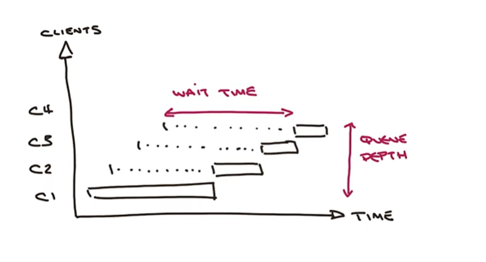
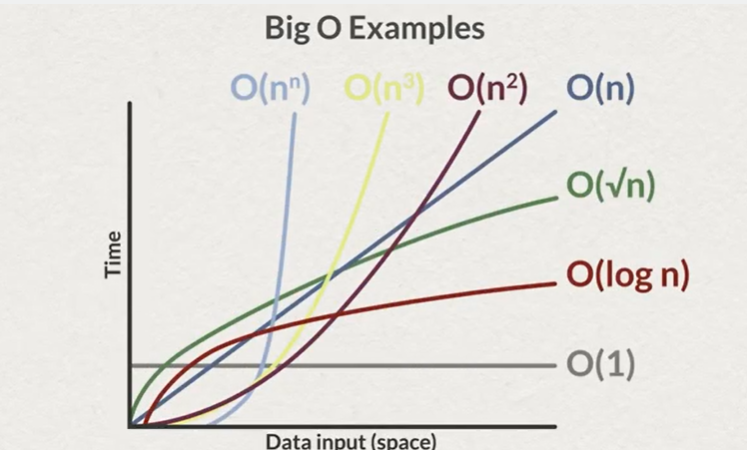
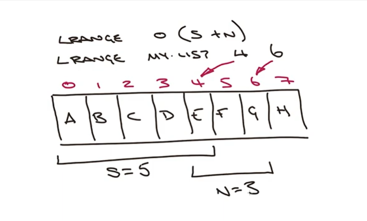

# Week 2b

## Big O notation
- describes the limiting behavior of a function
- created by Paul Bachmann and Edmind Landau
- from "Ordung" = "order of"

- O(1) 
    - constant time
    - not the same time for all operations
    - you can have variations based on the quantity of information, network and cpu load
    - e.g. `LPUSH`, `RPUSH` is O(1)
- O(N)
    - linear time

- examples:
    - ``DEL key [key ...]`
        - O(1) - when removing a String data type
        - O(N) - when removing multiple keys
        - O(M) - when the key removed contains a List, Set, Sorted Set or Hash (M the number of fields)
            - Redis removes atomically, so each element is removed one by one
    - `SINTER key [key..]` O(N*M)
        - N the number of sets
        - M the cardinality of the smallest set
    - `LRANGE key start stop` - O(S+N)
        - S a distance 
            - for small lists - from HEAD to start offset
            - for large lists - nearest end (HEAD or TAIL) to the start offset
        - N the number of elements requested
        - e.g.
            - `LRANGE list 9 17`
            - S=10, N=9 - start from 0 and count all elements returned
            - 

- things to consider
    - each command time complexity is documented
    - cardinality of the data
    - multiplying factors
    - clock times are not O time
    - should always test on real volume datasets
