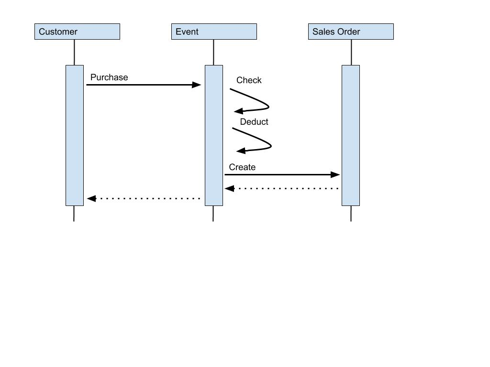
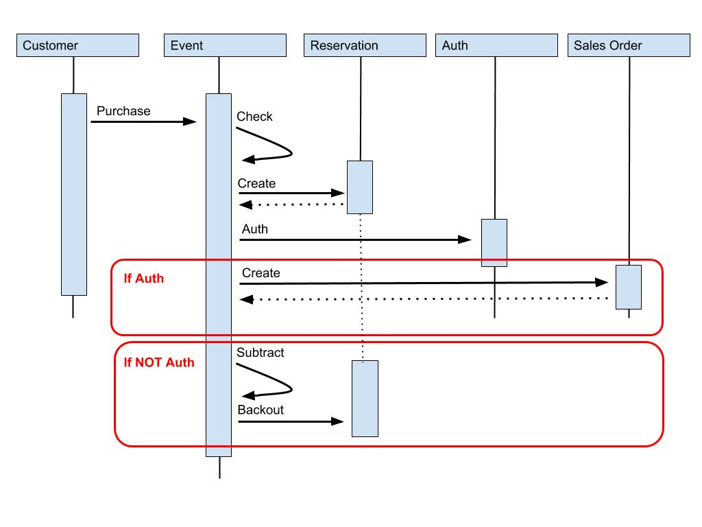

# Week 3

## Transactions
- all commands encapsulated in a transactions are
    - serialized and executed sequentially
    - atomicity is guaranteed
    - executed all or none
- `MULTI` - indicated the start of a transaction
    - **no nested transactions** (multi inside multi)
- `EXEC` - executes the queued commands
    - returns responses for all queued commands
- `DISCARD` throws away queued commands
- changes are isolated for each client
- while running a transaction
    - programming error
        - syntax - transaction marked as invalid
            - no queued command is executed
        - operation on incorrect data type
            - like `INCR` on a list - valid command but on incorrect data type
            - will continue to execute the rest of the commands
        - system errors (e.g. out of memory)
            - Redis has methods to resolve issues like this
    - **no rollbacks**
        - can't really avoid programming errors, this should be dealt in preproduction cycles
        - avoid performance penalty
        - allows Redis to operate at maximum throughput at minimum latency
- on redis cluster you can make transactions on only one shard

## Optimistic Concurrency Control
- observe changes in one or more keys
    - keyspace notifications
    - `WATCH key [key ..]`
        - a transaction can fail if any watched keys are changed
        - need to call before transaction
        - can run multiple WATCH commands and they cumulate
        - local to client, not global
        - all keys are automatically unwatched after EXEC is called
        - can watch any type of data
    - `UNWATCH key` stop watching a key
- abort transaction if observed key change

## Storing Simple Objects - Hashes
- mini-key value store within a key
- an alternative to store serialized strings
- enables you to access a part of the data
- schemaless - can change fields dynamically
- can't set expiration for individual fields
- `HSET key field value [field value ...]`
- `HGET key field [field ...]` - O(1)
    - returns in the same order as requested
    - returns nil for non existent field
- `HGETALL key`
    - O(N), blocking operation
    - under ~100 values can work well
- do not rely on order when fetching
- `HEXISTS key field` - checks if the field exists (0|1)
- `HSETNX key field value` - set only if the field does not already exists
- `HSCAN key cursor MATCH pattern`
    - if 0 returned means that scan is finished
    - O(1) for every call + O(N) for a complete iteration
    - better for large number of fields
- `HINCRBY key field increment` (can be negative)
- `HINCRBYFLOAT key field increment`
- `HDEL key field [field ...]`
    - when the last field is removed the whole hash is removed

## Storing Complex Objects
- methods:
    - Multiple Hashes
    - Multiple Hashes + Sets
    - Flattening Relationship in a single Hash

### Flattening Relationship
- use a naming convention to describe hierarchy
    - `HMSET key field:subfield1 100 field:subfield2 50`
    - get with `HMGET` or `HSCAN`
    - increment subfield using `HINCRBY key field:subfield1 1`
- pros
    - atomic updates
    - atomic deletes
    - no transactions needed
    - encapsulation
- cons
    - relationship maintenance - need more work when removing
    - multiple choices to define relationships
    - can end up with big hash

### Multiple Hashes
- split data between general and relation specific data
- `HMSET key        field1 "name" field2 "description"`
- `HMSET key:field3 subfield1 100 subfield2 50`
- can still increment with `HINCRBY`
- need to encode knowledge into code
- can also add relationship to a set
    - `SADD key key:field3`
- pros
    - extensible structure
    - independently store
    - expiration separated
- cons
    - many keys representing one object
    - relationship maintenance - need transactions to make operations on both atomically
    - on redis cluster you need to store all related keys on a shard to be able to use transactions

## Use case - Inventory Control
- requirements
    - Ticket purchase once and only once
    - Tickets held during purchase flow
    - Held tickets need to be return to the available pool if purchase is not completed
    - Purchased tickets can be viewed
    - Customers can make multiple purchases for the same event

Events schema

- use a flattened hash
- use as set for the sku-s 

Process sequence diagram

- Simple reservations steps
    - `WATCH event1`
    - `HGET event1:available:tier1`
    - `HGET event1:price:tier1`
    - check available >= qty
    - `MULTI`
        - `HINCRBY event1:available:tier1 -qty`
        - generate order_id
        - `HMSET sale_order:order_id1 '{ order_id1, event_sku, ...}'`
    - `EXEC`

- Normal purchase phases
    - Reservation
    - Credit Card Authorization
        - Complete Reservation on success
        - Back out Reservation on failure

- Normal purchase steps
    - Reservation
        - `WATCH event1`
        - `HGET event1:available:tier1`
        - `HGET event1:price:tier1`
        - check available >= qty
        - `MULTI`
            - generate order_id
            - ts = current time
            - `HINCRBY event1:available:tier1 -<qty>`
            - `HINCRBY event1:held:tier1 <qty>`
            - `HSETNX ticket_hold:event1 qty:order_id1 <qty>`
            - `HSETNX ticket_hold:event1 tier:order_id1 tier`
            - `HSETNX ticket_hold:event1 ts:order_id1 ts`
        - `EXEC`

    - Credit authorization
        - `WATCH event1`
        - `MULTI`
            - `HDEL ticket_hold:event1 qty:order_id1`
            - `HDEL ticket_hold:event1 tier:order_id1`
            - `HDEL ticket_hold:event1 ts:order_id1`
            - `HINCRBY event1:held:tier1 -<qty>`
            - `HMSET sale_order:order_id1 '{ order_id1, event_sku, ...}'`
        - `EXEC`

    - Back out hold - credit card failed
        - `WATCH event1`
        - qty = `HGET ticket_hold:event1 qty:order_id1`
        - tier = `HGET ticket_hold:event1 tier:order_id1`
        - `MULTI`
            - `HINCRBY event1:available:tier1 <qty>`
            - `HINCRBY event1:held:tier1 -<qty>`
            - `HDEL ticket_hold:event1 qty:order_id1`
            - `HDEL ticket_hold:event1 tier:order_id1`
            - `HDEL ticket_hold:event1 ts:order_id1`
        - `EXEC`

- Back out tickets automatically
    - check expired tickets
    - `HSCAN` periodically on `ticket_hold:event1 ts:*`
        - compare with a cutoff_limit
    - this is not remanded for large datasets
    - better use a sorted set for larger number of reservations
    
