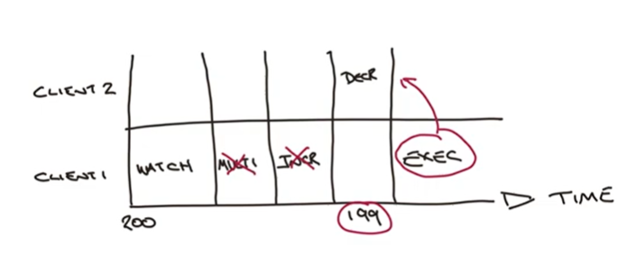

# Week 3

## Transactions
- all commands encapsulated in a transactions are
    - serialized and executed sequentially
    - atomicity is guaranteed
    - executed all or none
- `MULTI` - indicated the start of a transaction
    - **no nested transactions** (multi inside multi)
- `EXEC` - executes the queued commands
    - returns responses for all queed commands
- `DISCARD` throws away queued commands
- changes are isolated for each client
- while running a transaction
    - programming error
        - syntax - transaction marked as invalid
            - no queued command is executed
        - operation on incorrect data type
            - like `INCR` on a list - valid command but on incorrect data type
            - will continue to execute the rest of the commands
        - system errors (e.g. out of memory)
            - Redis has methods to resolve issues like this
    - **no rollbacks**
        - can't really avoid programming errors, this should be dealt in preproduction cycles
        - avoid performance penalty
        - allows Redis to operate at maximum throughput at minimum latency

## Optimistic Concurrency Control
- observe changes in one or more keys
    - keyspace notifications
    - `WATCH key [key ..]`
        - a transaction can fail if any watched keys are changed
        - need to call before transaction
        - can run multiple WATCH commands and they cumulate
        - local to client, not global
        - all keys are automatically unwatched after EXEC is called
        - can watch any type of data
    - `UNWATCH key` stop watching a key
- abort transaction if observed key change

## Hashes
- mini-key value store within a key
- an alternative to store serialized strings
- enables you to access a part of the data
- schemaless - can change fields dinamically
- `HSET key field value [field value ...]`
- `HGET key field [field ...]` - O(1)
    - returns in the same order as requested
    - returns nil for non existent field
- `HGETALL key`
    - O(N), blocking operation
    - under ~100 values can work well
- do not rely on order when fetching
- `HEXISTS key field` - checks if the field exists (0|1)
- `HSETNX key field value` - set only if the field does not already exists
- `HSCAN key cursor MATCH pattern`
    - if 0 returned means that scan is finished
    - O(1) for every call + O(N) for a complete iteration
    - better for large number of fields
- `HINCRBY key field increment` (can be negative)
- `HINCRBYFLOAT key field increment`
- `HDEL key field [field ...]`
    - when the last field is removed the whole hash is removed

