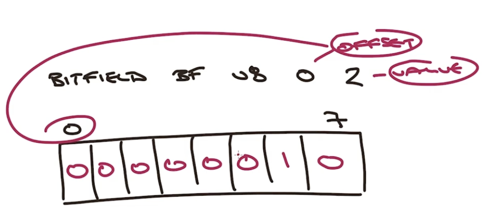
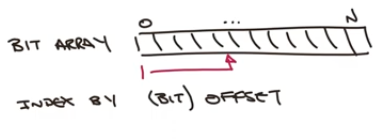
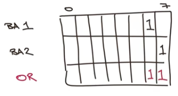
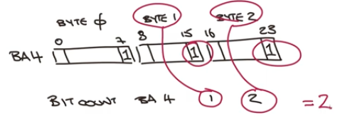

# Week 4

## Bitmaps
- Bitfields & Bit Array
- can store structures like
    - Histogram counters
    - File Permissions
- Commands to manipulate Bits
- No explicit Bit data type - stored as Strings


- can access bits by type+size or by offset

- 
    ```
    BITFIELD key
        [GET type offset]
        [SET type offset]
        [INCRBY type offset]
        [OVERFLOW WRAP|SAT|FAIL]
    ```
    - types specify:
        - Signed (i) or Unsigned(u)
        - Size - don't need to be 2 multiplier
    - limits
        - i64
        - u63
    - no schema - devs have to take care of the offsets

    - e.g. 1
        - `BITFIELD bf1 SET u8 0 2`
        - `BITFIELD bf1 GET u8 0`   -> 2
        - `GET bf1` -> "\x02"
    

    - e.g.2
        - `BITFIELD bf2 SET u8 #1 5`
        - `BITFIELD GET u8 #1 GET u8 8`
            - (int) 5
            - (int) 5
        - Redis will compute the position
        - `BITFIELD bf2`
            - "\x00\x05"
    
## Bit Arryas



- `GETBIT key offset`
- `SETBIT key offset value`
- prefered is `BITFIELD` with u1 type
- `BITCOUNT key [start end]` - count the set bits within a range
- `BITOP operation destkey key [key ...]` - perform byte wise operations like AND, OR, XOR, NOT, store in another key
- `PITPOS key bit [start] [end]` - finds the first set or unset bit from a given index

- examples:
    - `BITFIELD ba1 SET u1 6 1`
    - `BITCOUNT ba1` -> 1
    - `BITFIELD ba2 SET u1 7 1`
    - `BITOP OR ba3 ba1 ba2`  (destination ba3)
    - `BITCOUNT ba3` -> 2
    - 

    - `BITCOUNT` counts on byte level, not bit level
    - `BITFIELD ba4 SET u1 7 1 DET u1 15 1 SET u1 23 1` - set bits 7, 15, and 23 of a 3 byte long string
    - `BITCOUNT ba4` -> 3, returns the count of all set bits
    - `BITCOUNT ba4 1 2` -> returns 2 from the second and third bytes
    - 
    - `BITCOUNT ba4 0 -2` -> also returns 2, but from the first and second bytes

- quizz 2 explained
    
    - 
        ```
        bitfield  ba-q1 set u8 #0 42
        bitfield  ba-q2 set u8 #0 19
        bitop and ba-q3 ba-q1 ba-q2
        ```
    - 19 is  10011
    - 42 is 101010
    - and   000010 = 2
