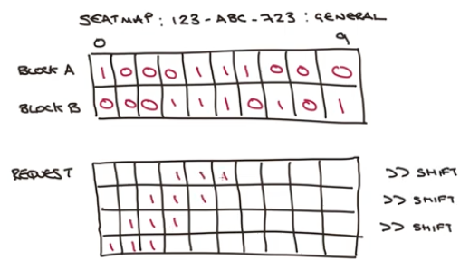
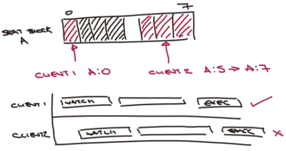

# Week 4

## Bitmaps
- Bitfields & Bit Array
- can store structures like
    - Histogram counters
    - File Permissions
- Commands to manipulate Bits
- No explicit Bit data type - stored as Strings


- can access bits by type+size or by offset

- 
    ```
    BITFIELD key
        [GET type offset]
        [SET type offset]
        [INCRBY type offset]
        [OVERFLOW WRAP|SAT|FAIL]
    ```
    - types specify:
        - Signed (i) or Unsigned(u)
        - Size - don't need to be 2 multiplier
    - limits
        - i64
        - u63
    - no schema - devs have to take care of the offsets

    - e.g. 1
        - `BITFIELD bf1 SET u8 0 2`
        - `BITFIELD bf1 GET u8 0`   -> 2
        - `GET bf1` -> "\x02"
    

    - e.g.2
        - `BITFIELD bf2 SET u8 #1 5`
        - `BITFIELD GET u8 #1 GET u8 8`
            - (int) 5
            - (int) 5
        - Redis will compute the position
        - `BITFIELD bf2`
            - "\x00\x05"
    
## Bit Arryas


- `GETBIT key offset`
- `SETBIT key offset value`
- prefered is `BITFIELD` with u1 type
- `BITCOUNT key [start end]` - count the set bits within a range
- `BITOP operation destkey key [key ...]` - perform byte wise operations like AND, OR, XOR, NOT, store in another key
- `PITPOS key bit [start] [end]` - finds the first set or unset bit from a given index

- examples:
    - `BITFIELD ba1 SET u1 6 1`
    - `BITCOUNT ba1` -> 1
    - `BITFIELD ba2 SET u1 7 1`
    - `BITOP OR ba3 ba1 ba2`  (destination ba3)
    - `BITCOUNT ba3` -> 2
    - 

    - `BITCOUNT` counts on byte level, not bit level
    - `BITFIELD ba4 SET u1 7 1 DET u1 15 1 SET u1 23 1` - set bits 7, 15, and 23 of a 3 byte long string
    - `BITCOUNT ba4` -> 3, returns the count of all set bits
    - `BITCOUNT ba4 1 2` -> returns 2 from the second and third bytes
    - 
    - `BITCOUNT ba4 0 -2` -> also returns 2, but from the first and second bytes

- quizz 2 explained
    
    - 
        ```
        bitfield  ba-q1 set u8 #0 42
        bitfield  ba-q2 set u8 #0 19
        bitop and ba-q3 ba-q1 ba-q2
        ```
    - 19 is  10011
    - 42 is 101010
    - and   000010 = 2

### Use cases
- Histograms
    - `BITFIELD hist INCRBY u32 #23 1` - set one counter
    - `BITFIELD hist GET u32 #23` - get one counter
    - `GET hist` - get all counters
- Permission bits & masks
    - `BITOP XOR file1 request file1`

## Use Case: Seat Reservations
**Requirements**
- Sea map maintained for the event
- Customer can find block of seats that match their requirement
- Seats can be reserved and booked once and only once
- Concurrent booking of disparate seates are allowd

### Create a Seat Map
- use a u32 key, can use multiple for more
- in `create_event` will create the required bitmap
    - use a simple convention for seat blocks: A-Z-AA...
        - seatmap:<event_sku>:<tier>
    - 
    - fill all with 1s using a helper function
        - `int(math.pow(2, min(seats_per_block, __max_seats_per_block__))) - 1`
    - use `redis.execute_command("BITFIELD", key, *vals)` - there is no dedicated method in python
- `get_event_seat_map` - retrieve the seatmap with `BITFIELD key GET u32 0`[0]
- `print_event_seat_map` will use `scan_iter` to find all matches
    - 
    - wrapp every 10 seats to make visualization easyer
- 

### Checking Seat Availability


- `get_available`
    - check (seat_map & required_block) == required_block (contiguos)
        - if not shift bits in the required_block
- `fid_seat_selection`
    - find all blocks for event and ticket tier
    - use SKU, ticket tier, sears_required
    - scan_iter for all keys
        - `bitcount` >= seats_required
        - `get_event_seat_block`
        - get_available -> check > 0 => append seats

### Reserving Seats


- Try to Reserve A[0] and A[5:7] - with WATCH, MULTI & EXEC on key would fail for the second client
    - can become an issue for multiple clients at the same time

- `XOR` approach - using a latch

    - client 1 wants to reserve A0 -> use XOR operator to apply change
    - doesn't prevent writing on the same key
    - no need to know previous values, but needs a temporary latch
        - set with NX=True and PX=5000
    - this improves concurrency (user experiance)

## Publish / Subscribe
- allow for simple message brockers
- doesn't provide delivery guarantee - if a consumer goes offline it will not receive the messages
- suitable for feeds and streams (gaming, chat), but will miss the messages while disconnected
- order is guaraneed on a single node
- Types:
    - Simple Syndication
        - `PUBLISH channel message`
        - `SUBSCRIBE channel [channel ...]`
        - `UNSUBSCRIBE [channel [channel ...]]`
    - Pattern Syndication
        - `PSUBSCRIBE pattern [pattern ...]`
        - `PUNSUBSCRIBE [pattern [pattern ...]]`
    - Admin
        - `PUBSUB subcommand [argument [argument ...]]`

- `PUBLISH`
    - send a single message to a single channel
    - message can be any arbitrary binary string
    - messages sent over the network will be multiplied for each client subscribed
        - needs carefull planning
- `SUBSCRIBE`
    - subscribe to a fully qualified channel name (nmo wild cards)
    - is a blocking command, but Redis can accept UNSUBSCRIBE meanwhile
    - returns the number of clients
        - 
        ```bash
        > subscribe ch-1
        subscribe
        ch-1
        (integer) 1
        ```
    - when publishing you will get the number of clients received the message
        - publisher
        ```bash
        > publish ch-1 hello
        (integer) 1
        ```
        - subscriber
        ```bash
        message
        ch-1
        hello
        ```
    - for multiple subscribers:

    

    

    

- `PUBSUB`
    - `CHANNELS [pattern]` - list the active channels
    - `NUMSUB [channel1 ... channel-N]` - number of subscribers - excluding patterned subscribers
    - `NUMPAT` - number of patterned subscribers and the number of patterns

- `PSUBSCRIBE`
    - `?` - single wildcard
    - `*` - multiple wildcards
    - `[..]` - alternate characters
    - `^` - prefixes
    - ! use with care, all patterns will be checked on publishing a message
    -  

## Use case: Notifications & Fan Out
- Fan Out for Analytics of sales made
    - Sales by event
    - Sales by time of day
- Pattern subscription
    - Pick lottery winners
    - Show orders in real time

### Sales by Event
- aggregate sales and sales value for each event
- totals maintained as each order is processed
- `purchase` generate orders then 
    - `post_purchase` - publish to
        - `sales_order_notify` - message: order_id 
        - `sales_order_notify:{event}` - message: order_id
- `listener_events_analytics`
    - subscribe to `sales_order_notify`
    - `order_id = message['data']`
    - get order details
    - increment `total_sales`
    - increment `total_tickets_sold` 


### Sales by time of day
- real time histogram of sales by time of day
- see when peaks occur and observe those peaks
- `listener_sales_analytics`
    - subscribe to `sales_order_notify`
    - get order details for the timestamp of the order0
    - use a BITFIELD (u16) for the histogram
        - calculate bit offset: h * 16
        - eg. 9pm: 21*16 = 336 -> `BITFIELD INCRBY key u16 336`

### Filter Events
- pattern: `*Ceremony` - all events that end with Ceremony
- pattern: `[^Opening]*` - all events not starting with Opening (so actually Closing events)


