# Week 5

## Geospatial
- Store Longitude and latitude pairs
- Retrieve: distance, rradius
- Advantages: low latency and high throughput
- Use case: GPS tagged devices

### GeoHash
- 52 bits integer - [docs](https://en.wikipedia.org/wiki/Geohash)
- Stored as Sorted Sets
- uses Y,X coordinates - longitude(meridian, vertical), [-180, 180], latitude (paralel, horizontal, [-90, 90])
    - for compatibility with other services, data sources and standards ([EPSG:900913](https://epsg.io/900913), )

### Geospatial commands
- [GEOADD](https://redis.io/docs/latest/commands/geoadd/)
- `GEOADD key longitude latitude member [longitude latitude member]`
- stored as a Sorted Set having the coordinates as score
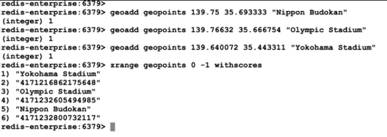

- `GEOPOS key member [member ...]` - returns the longitude and latitude of a member

- `GEOHASH key member [member ...]` - returns the GeoHash of the member in the set
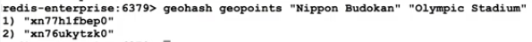
    - returns an 11 character representation of the hashed value compatible with other systems (e.g. [geohash.org](http://geohash.org/xn77h1fbep0))
    - remove some ending characters will decrease precision
- uses the [Haversine formula](https://en.wikipedia.org/wiki/Haversine_formula) - assumes a perfect sphere
    - accuracy of 60cm at the equator and 0.5% as you reach the poles
    - better for regions nearer to the ecuator
    - start-end point - Meridian at Greenwich Observatory in London
    - longitude between -180 to 180
    - latitude between -85.05112878 and 85.05112878
    - `GEOADD` will fail if values are outside the boundries
- can use Sorted Sets operations
    - `ZUNIONSTORE` and `ZINYERSTORE`
    - :exclamation: by default this commands will SUM up the score
    - you need to use MIN - MAX aggregate operators to get the points
    - remove with `ZREM`
    - :exclamation: `GEOADD` on the same member wil UPDATE the members position

- `GEODIST key member1 member2 [unit]` - unit = m, km, ft, miles
    - can not copute dist across different keys
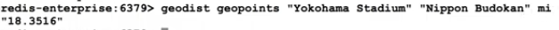

- `GEORADIUS key longitude latitude radius [unit]`
    - other params 
        - WITHCOORD
        - WITHDIST
        - WITHHASH
        - COUNT count
        - ASC|DESC
        - STORE key - store the GeoHash as a score - can do further Geospatial operations
        - STOREDIST key - store the distances as score
    - the center is in the longitude, latitude
- `GEORADIUSBYMEMBER key member radius [unit]` + other params
    - the center is in the member's coordinates
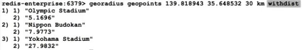
    - get the furthest only
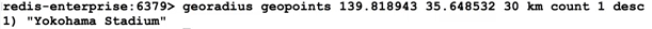
    - the member itself is also returned
    
    - The other point was more than 17 mi away
    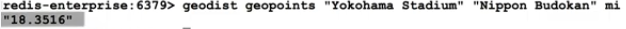
    - the search is done by reducing precision in the numerical representation than it will search in the 1 + 8 areas around the point
    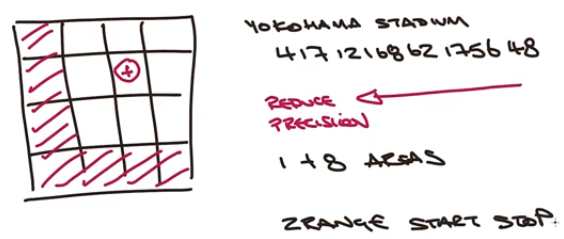

> [!WARNING]
> - Any query with a large result set will impact network overhead 
>   - Should limit the result set
> - Counting effort is proportional to the number of points in the search area
>   - Should limit the search area

### Use Case: Finding Events and Venues
Objectives:
- Find venues from a given point
- Find events from a given subway station
- Find venues on a given subway line

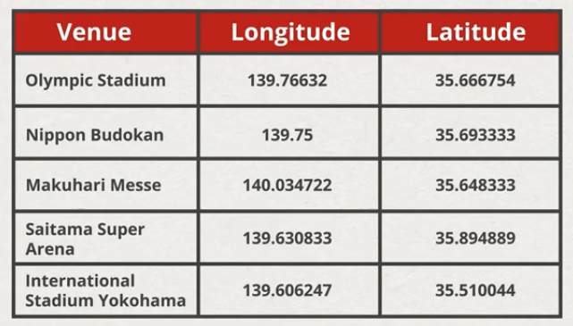

- `create_venues` - uses `geoadd` to add coordinates and venue to the `geo:venues` key
- use `georadius` to search venues within a specified area
- use `georadiusbymember` to search venues near a specified stadium
    - will also return the stadium and distance 0.0
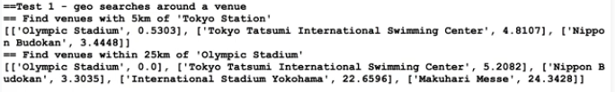


- use faceted search
- `geoadd` long, lat, venue to key: geo:events:{event_type}
- use `georadius` to query matching events by sport
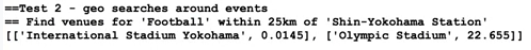

- Store subway Lines data

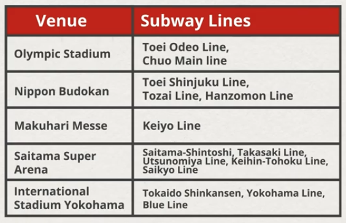
- use a reverse index
- key: geo:transits:{subway_line}
- use `georadius` with the station and the maximum distance
- use `geodist` to compute the distance
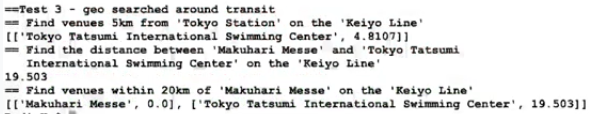
    - `georadius "geo:transits:Keiyo Line" 139.771977 35.668024 5 km`
    - `geodist "geo:transits:Keiyo Line" "Makuhari Messe" "Tokyo Tatsumi International Swimming Center" km`
    - `georadiusbymember "geo:transits:Keiyo Line" "Makuhari Messe" 20 km`


## Lua
- server side scripting
- lightweight, efficient, embeddable scripting language
- Lua is the Portuguese word for moon (developed in Rio, Brasil)
- widely adopted because is fast, lightweight and powerful
- small footprint, easy to incorporate into products
- integrated in Redis
- Lua allows you to wrap a set of Redis commands, like loops, conditionals etc, to manipulate keys without a network trip
- can think as database procedures
- use with care
- ran atomically like commands

- `EVAL script numkeys key [key ...] arg[arg ...]`
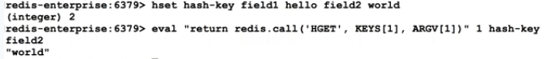
- deal errors when calling redis commands inside lua
    - redis.call - will propagate the error and EVAL will fail
    - redis.pcall - will return the error response - dealth then programatically
- KEYS[] - include all keys passed
- ARGV[] - include all arguments passed
- Language Features
    - Variables
    - Operators
    - Conditions
    - Loops, etc
- Can define complex control flows while executing commands against dthe data stored in Redis
- Lua scripts are similar to Transactions, they run in a single atomic processes, with some exceptions

### Good practices
Rule #1 
- keys should be passed in, not hard-coded 
- this is not enforced

Rule #2
- Pay attention to array keys, they are one-based

Rule #3
- pass floats as strings to preserve precisions - by default they are truncated to int

Handle ints
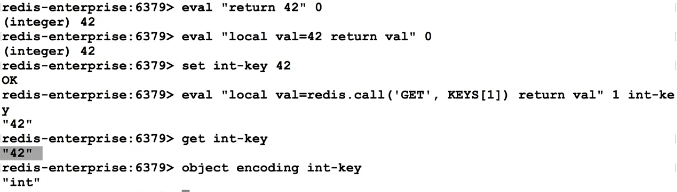

Return lua tables as multi bulk
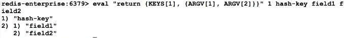

### Data Types conversion
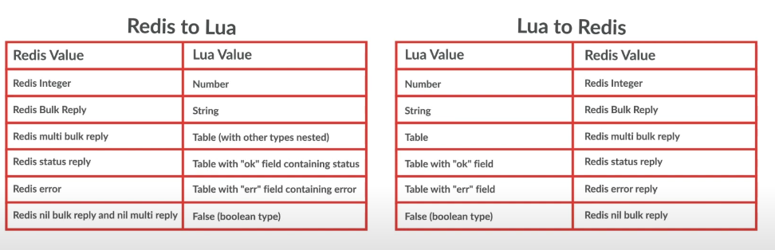

### EVAL
- is and atomic operation, with some exceptions
- steps:
    - sent over the network
    - parsed
    - executed
    - results are returned
    - cache compiled scripts
- `SCRIPT LOAD script` - loads the script and returns a "hash digest"
- `EVALSHA sha1 numkeys key [key ...] arg[arg ...]` - run already loaded scripts
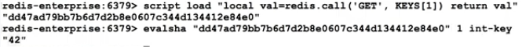
- `SCRIPT EXISTS sha1[sha1 ...]` - return an booleans return (1 = exists)
- `SCRIPT FLUSH` - remove all cached scripts - cleanup
- `SCRIPT KILL` - terminate the current executing script
    - if a script has a bug, or finishes too slow
- `SCRIPT DEBUG YES|SYNC|NO` - invoke an interactive debugger
    - :exclamation: DO NOT use in Production

- `EVAL` will run atomically, oder commands will be queued up waiting to finish
- a script may run nup to 5 seconds before Redis starts accepting new commands
    - default can be changed
- when the execution threshold is surpassed, Redis will not terminate the script
    - the server will log a "long running script"
    - Redis will start accepting commands, but will not run them
    - Redis will respond with a BUSY response
        - you need to handle the BUSY response in the code
    - if a script is read only or it has surpassed the execution threashold but has not performed a right
        - then `SCRIPT KILL` can be ran safely
        - however if data has ben written, the only safe option is `SHUTDOWN NOSAVE` command
            - terminate server, without saving anything after the last Disk Flush
    - :exclamation: devs should make sure scripts don't excede the threshold

#### EVAL tips
- keep the scripts to absolute minumum
    - check commands, time complexity, data cardinality
- know that script defines your transaction
    - break the script down in smaller pieces
- test, test, test with production like values


## Use CaseL Inventory with Lua

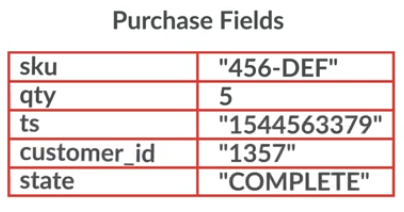
- model purchase data as a hash

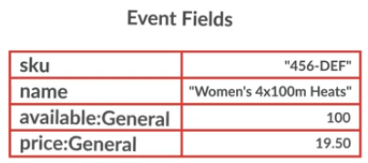
- model the event as a hash

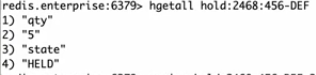
- model the purchase hold as a hash with expiration

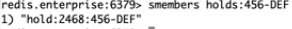
- create an events specific set to link holds to event

### Manage Lua Scripts with Python
- define the script as a multiline variable and use `redis.register_script`
    - this will load the script into redis
    - and will save the sha code into a Python callable
- run the Python callable
    - now the Lua code will actuall run in Redis

```python
stats_script = """
    -- Convert arguments to numbers
    local k1 = redis.call('get', KEYS[1])
    local k2 = redis.call('get', KEYS[2])

    if ARGV[1] == "sum" then
      return k1 + k2
    elseif ARGV[1] == "max" then
      return math.max(k1, k2)
    else
      return nil
    end
"""
# Pythoon will register the script and keep in the calable stats the sha code
stats = redis.register_script(stats_script)                     
# now the script will be actually ran
total = stats(["hits:homepage", "hits:loginpage"], ["sum"])
```

### Ticket Purchase Flow
1. Reserve the tickets by attempting to create a new ticket hold
2. If the reservation is successful, create a new purchase with an initial state of RESERVE
3. Wait for user payment information
4. If the ticket hold has not expired, then transition the purchase to AUTHORIZE
5. If the credit card purchase is cussessful, then complete the purchase by permanently reserving the seats and transitioning the purchase to COMPLETE

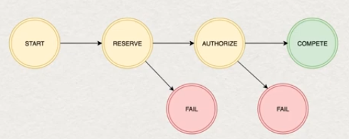

### Code the purchase state update

```lua
-- KEYS[1] is a key of type Hash pointing to a purchase.
-- ARGV[1] is the newly-requested state.
-- ARGV[2] is the current timestamp.
-- Returns 1 if successful. Otherwise, return 0.
local current_state = redis.call('HGET', KEYS[1], 'state')
local requested_state = ARGV[1]

if ((requested_state == 'AUTHORIZE' and current_state == 'RESERVE') or
    (requested_state == 'FAIL' and current_state == 'RESERVE') or
    (requested_state == 'FAIL' and current_state == 'AUTHORIZE') or
    (requested_state == 'COMPLETE' and current_state == 'AUTHORIZE')) then
    redis.call('HMSET', KEYS[1], 'state', requested_state, 'ts', ARGV[2])
    return 1
else
    return 0
end
```
This is an ideal example of the Lua scripting in Redis mindset
- is brief
- simple implementation, Redis-like operations
- simplifies application code
- preserves atomicity
- no need to add special exeption handling for any potential errors

### Reserving tickets
- comparing just `requested_tickets <= event_capacity` wil lnot be enouth
- then we do (tickets_held + requested_tickets) <= event_capacity
    - this requires the portion that computes the total number of existing holds

```lua
-- KEYS[1] is a key of type Hash pointing to an event.
-- ARGV[1] is the customer ID.
-- ARGV[2] is the requested number of general admission tickets.
-- ARGV[3] is the number of seconds to hold the tickets.
-- Returns 1 if successful. Otherwise, returns 0.

local event_capacity = tonumber(redis.call('HGET', KEYS[1], 'available:General'))
local ticket_holds_key = 'holds:' .. KEYS[1]

local customer_hold_key = 'hold:' .. ARGV[1] .. ':' .. KEYS[1]
local requested_tickets = tonumber(ARGV[2])
local hold_timeout = tonumber(ARGV[3])

-- Calculate the total number of outstanding holds
local hold_keys = redis.call('SMEMBERS', ticket_holds_key)
local tickets_held = 0

for _,hold_key in ipairs(hold_keys) do
    local count = redis.call('HGET', hold_key, 'qty')
    -- If the return is nil, then remove the hold from the list
    if (count == nil) then
        redis.call('SREM', ticket_holds_key, hold_key)
    else
        tickets_held = tickets_held + count
    end
end

-- If capacity remains, then create a new lease
if (tickets_held + requested_tickets) <= event_capacity then
    redis.call("HMSET", customer_hold_key, 'qty', requested_tickets, 'state', 'HELD')
    redis.call("EXPIRE", customer_hold_key, hold_timeout)
    redis.call("SADD", ticket_holds_key, customer_hold_key)
    return 1
else
    return requested_tickets
end

```
- in Lua you cancatenate strings with `..` operator

