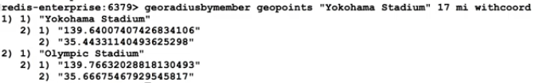

# Week 5

## Geospatial
- Store Longitude and latitude pairs
- Retrieve: distance, rradius
- Advantages: low latency and high throughput
- Use case: GPS tagged devices

### GeoHash
- 52 bits integer - [docs](https://en.wikipedia.org/wiki/Geohash)
- Stored as Sorted Sets
- uses Y,X coordinates - longitude(meridian, vertical), [-180, 180], latitude (paralel, horizontal, [-90, 90])
    - for compatibility with other services, data sources and standards ([EPSG:900913](https://epsg.io/900913), )

### Geospatial commands
- [GEOADD](https://redis.io/docs/latest/commands/geoadd/)
- `GEOADD key longitude latitude member [longitude latitude member]`
- stored as a Sorted Set having the coordinates as score

- `GEOPOS key member [member ...]` - returns the longitude and latitude of a member

- `GEOHASH key member [member ...]` - returns the GeoHash of the member in the set

    - returns an 11 character representation of the hashed value compatible with other systems (e.g. [geohash.org](http://geohash.org/xn77h1fbep0))
    - remove some ending characters will decrease precision
- uses the [Haversine formula](https://en.wikipedia.org/wiki/Haversine_formula) - assumes a perfect sphere
    - accuracy of 60cm at the equator and 0.5% as you reach the poles
    - better for regions nearer to the ecuator
    - start-end point - Meridian at Greenwich Observatory in London
    - longitude between -180 to 180
    - latitude between -85.05112878 and 85.05112878
    - `GEOADD` will fail if values are outside the boundries
- can use Sorted Sets operations
    - `ZUNIONSTORE` and `ZINYERSTORE`
    - :exclamation: by default this commands will SUM up the score
    - you need to use MIN - MAX aggregate operators to get the points
    - remove with `ZREM`
    - :exclamation: `GEOADD` on the same member wil UPDATE the members position

- `GEODIST key member1 member2 [unit]` - unit = m, km, ft, miles
    - can not copute dist across different keys

- `GEORADIUS key longitude latitude radius [unit]`
    - other params 
        - WITHCOORD
        - WITHDIST
        - WITHHASH
        - COUNT count
        - ASC|DESC
        - STORE key - store the GeoHash as a score - can do further Geospatial operations
        - STOREDIST key - store the distances as score
    - the center is in the longitude, latitude
- `GEORADIUSBYMEMBER key member radius [unit]` + other params
    - the center is in the member's coordinates

    - get the furthest only

    - the member itself is also returned
    
    - The other point was more than 17 mi away
    
    - the search is done by reducing precision in the numerical representation than it will search in the 1 + 8 areas around the point
    

> [!WARNING]
> - Any query with a large result set will impact network overhead 
>   - Should limit the result set
> - Counting effort is proportional to the number of points in the search area
>   - Should limit the search area